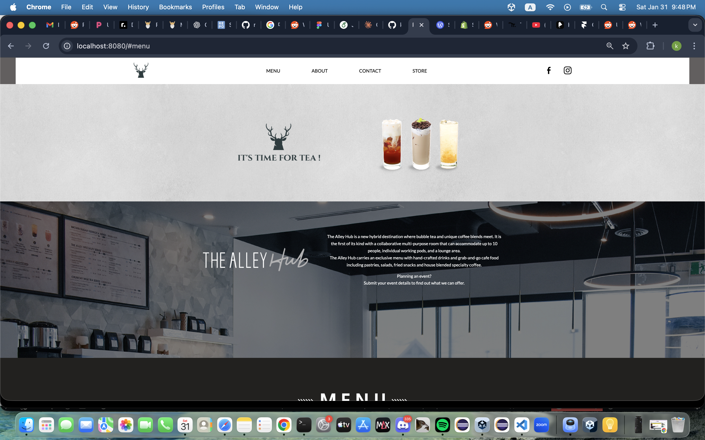
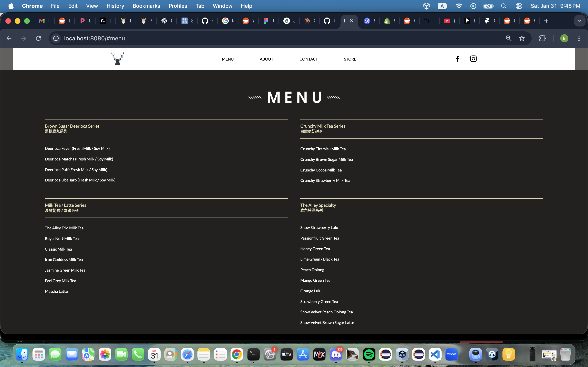
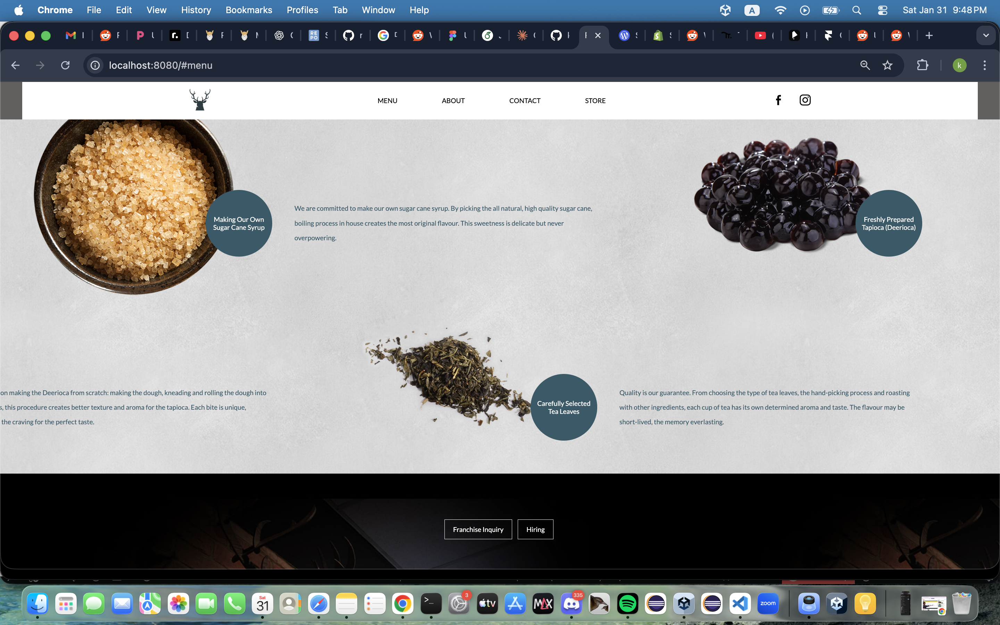
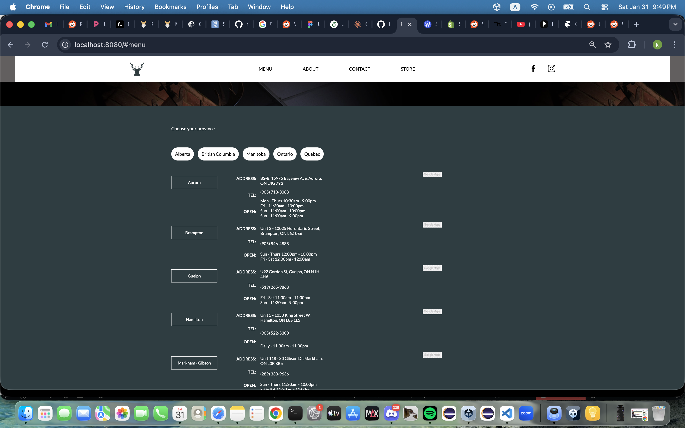

#  Bubble Tea Store

> Modern, responsive website clone for a bubble tea shop

[Live Demo](https://katelynyew.github.io/the-alley-website-clone) | [View Code](https://github.com/katelynyew/)



---

##  Table of Contents
- [Overview](#overview)
- [Features](#features)
- [Screenshots](#screenshots)
- [Tech Stack](#tech-stack)
- [Getting Started](#getting-started)
- [What I Learned](#what-i-learned)

---

##  Overview

A pixel-perfect recreation of a commercial bubble tea store website featuring smooth navigation, responsive design, and interactive UI components. This single-page application showcases modern web design principles and user-friendly navigation.

---

##  Features

✅ **Smooth Scrolling** - Seamless navigation between sections  
✅ **Responsive Design** - Mobile-first approach, perfect on all devices  
✅ **Interactive Elements** - Engaging call-to-action buttons  
✅ **Multiple Sections** - Menu, About, Franchise, Contact  
✅ **Social Integration** - Links to social media platforms  
✅ **Modern UI/UX** - Clean, professional design  

---

##  Screenshots

### Home Section


### Menu Section


### Franchise Section


### Store Section


---

##  Tech Stack

**Frontend:**
- Vanilla JavaScript
- HTML5
- CSS3 (Grid & Flexbox)

**Design Approach:**
- Mobile-First Responsive Design
- CSS Grid for complex layouts
- Flexbox for component alignment
- Smooth scroll behavior

---

##  Sections

**Hero** - Eye-catching landing with call-to-action  
**Menu** - Product showcase with images and descriptions  
**About Us** - Company story and values  
**Franchise** - Information for potential franchise partners  
**Contact** - Location and social media links  
**Footer** - Site navigation and additional info  

---

##  Getting Started
```bash
# Clone repository
git clone https://github.com/katelynyew/bubble-tea-store.git

# Navigate to directory
cd bubble-tea-store

# Open in browser
open index.html
```

---

##  What I Learned

**Technical Skills:**
- Single-page application structure
- Smooth scroll navigation implementation
- Mobile-first responsive design
- CSS Grid for complex layouts
- Flexbox for flexible components
- UI/UX best practices

**Design Principles:**
- Visual hierarchy and spacing
- Color theory and branding
- Typography for readability
- Responsive breakpoints
- Accessibility considerations

**Responsive Breakpoints:**
```css
/* Mobile: 320px - 768px */
/* Tablet: 769px - 1024px */
/* Desktop: 1025px+ */
```

---

##  Future Enhancements

- [ ] Online ordering system
- [ ] Shopping cart functionality
- [ ] Store locator with maps integration
- [ ] Customer reviews section
- [ ] Admin panel for menu management
- [ ] Newsletter signup
- [ ] Loyalty program integration

---

##  License

MIT License

---

<p align="center">Made with ❤️ by Katelyn Yew</p>
<p align="center">
  <a href="https://github.com/katelynyew">GitHub</a> •
  <a href="https://linkedin.com/in/katelynyew">LinkedIn</a>
</p>